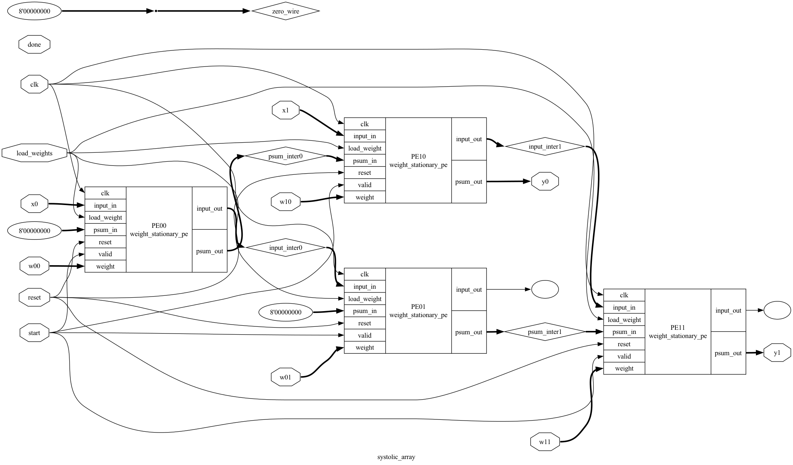

<h1 align="center">Systolic Array Implementation</h1>

  <p align="center">
    Verilog implementation of a 2x2 systolic array for matrix multiplication.
  </p>
</div>

<!-- REMOVE THIS IF YOU DON'T HAVE A DEMO -->
<!-- TIP: You can alternatively directly upload a video up to 100MB by dropping it in while editing the README on GitHub. This displays a video player directly on GitHub instead of making it so that you have to click an image/link -->
<div align="center">
  <a href="img/systolic_array.png">
    
  </a>
</div>

## Table of Contents

<details>
  <summary>Table of Contents</summary>
  <ol>
    <li>
      <a href="#about-the-project">About The Project</a>
      <ul>
        <li><a href="#key-features">Key Features</a></li>
      </ul>
    </li>
    <li><a href="#architecture">Architecture</a></li>
    <li>
      <a href="#getting-started">Getting Started</a>
      <ul>
        <li><a href="#prerequisites">Prerequisites</a></li>
        <li><a href="#installation">Installation</a></li>
        <li><a href="#running-tests">Running Tests</a></li>
      </ul>
    </li>
    <li><a href="#acknowledgments">Acknowledgments</a></li>
  </ol>
</details>

## About The Project

This repository contains a Verilog implementation of a minimal 2×2 systolic array designed for efficient matrix multiplication. The systolic array architecture enables parallel computations with high throughput and reduced memory access, making it suitable for hardware acceleration of matrix operations. The design uses a weight-stationary approach.

### Key Features

- **2x2 Systolic Array:** Implements a basic systolic array with 4 processing elements (PEs).
- **Weight-Stationary Architecture:** Weights are loaded and held within each PE, minimizing data movement during computation.
- **Multiply-Accumulate Operations:** Each PE performs multiply-accumulate operations.
- **Data Skewing:** Input data is provided in a skewed format to ensure proper data flow through the array.
- **Testbenches:** Includes Python-based testbenches using Cocotb for verifying the functionality of the PE and the entire systolic array.
- **VCD Dumps:** Generates Value Change Dump (VCD) files for waveform visualization and debugging.

## Architecture

The 2x2 systolic array is structured as follows:

```
X0→ [PE00]→[PE01]
     ↓       ↓
X1→ [PE10]→[PE11]
     ↓       ↓
    Y0     Y1
```

- **Processing Elements (PEs):** Arranged in a 2x2 grid, each PE performs a multiply-accumulate operation. The `src/weight_stationary_pe.sv` file defines the PE module.
- **Data Flow:** Input matrix A elements flow horizontally, and the partial sum in each PE flows down vertically
- **Result Accumulation:** Partial results are accumulated within each PE.


## Getting Started

### Prerequisites

- Icarus Verilog:

  ```
  brew install icarus-verilog # macOS
  sudo apt-get install iverilog # Ubuntu
  ```

- Python 3
- Cocotb:
  ```
  pip install cocotb
  ```
- Cocotb-VPI: Follow instructions on cocotb documentation for setting up VPI with Icarus Verilog

### Installation

1. Clone the repository:
   ```
   git clone https://github.com/surjahead/systolic-array.git
   cd systolic-array
   ```

### Running Tests

1.  **PE Test:**

    ```
    make test_pe
    ```

2.  **Systolic Array Test:**

    ```
    make test_sys_array
    ```

These commands will:

- Compile the Verilog code using Icarus Verilog.
- Run the Python testbenches using Cocotb.
- Check for any failures reported in the `results.xml` file.
- Generate VCD files (`pe.vcd`, `sys_array.vcd`) for waveform analysis.

## Acknowledgments

- The Cocotb framework was instrumental in creating the test environment.
